# Tutorial 2: Basic scRNA-seq Analysis with Scanpy

## Overview

Filtered count matrix from Tutorial 1 processed through a complete Scanpy pipeline covering quality control, normalization, dimensionality reduction, and clustering.

## Pipeline

```
MTX input → QC metrics → Filtering → Normalization → HVG selection → PCA → Neighbors → UMAP → Leiden clustering → Marker genes
```
## Tools

| Tool | Version | Purpose |
|------|---------|---------|
| Scanpy | 1.10.x | Full scRNA-seq analysis |
| AnnData | 0.11.x | Data structure |
| leidenalg | latest | Graph clustering |
| scrublet | latest | Doublet detection |

## Key Parameters

- Min genes per cell: 200
- Max genes per cell: 2500
- Max mitochondrial %: 5
- Highly variable genes: 2000 (seurat flavor)
- PCA components: 50
- Neighbors: n_neighbors=10, n_pcs=40
- Leiden resolution: 0.5

## Outputs

| File | Description |
|------|-------------|
| outputs/pbmc_tutorial_output.h5ad | Final AnnData object (not tracked -- exceeds GitHub 100MB limit) |
| outputs/qc_violin.jpeg | Violin plots of QC metrics |
| outputs/qc_scatter.jpeg | Scatter plot of counts vs genes colored by MT% |
| outputs/highly_variable_genes.jpeg | Highly variable gene selection plot |
| outputs/pca_variance_ratio.jpeg | PCA variance ratio (elbow plot) |
| outputs/pca_plot.jpeg | PCA colored by sample and MT% |
| outputs/umap_sample.jpeg | UMAP colored by sample |
| outputs/umap_leiden.jpeg | UMAP colored by Leiden clusters |
| outputs/umap_doublets.jpeg | UMAP showing predicted doublets |
| outputs/umap_qc_metrics.jpeg | UMAP colored by QC metrics |
| outputs/umap_leiden_resolutions.jpeg | UMAP at different Leiden resolutions |
| outputs/dotplot_known_markers.jpeg | Dotplot of known cell type marker genes |
| outputs/dotplot_ranked_genes.jpeg | Dotplot of top ranked genes per cluster |
| outputs/umap_marker_genes.jpeg | UMAP colored by individual marker genes |

## Results

### QC Metrics

| QC Violin | QC Scatter |
|-----------|------------|
| 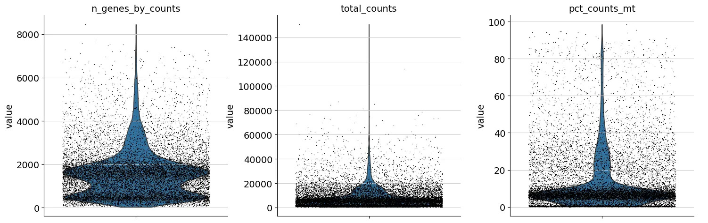 | 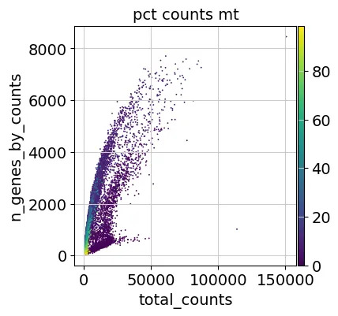 |

### Highly Variable Genes & PCA

| Highly Variable Genes | PCA Variance Ratio |
|----------------------|--------------------|
| 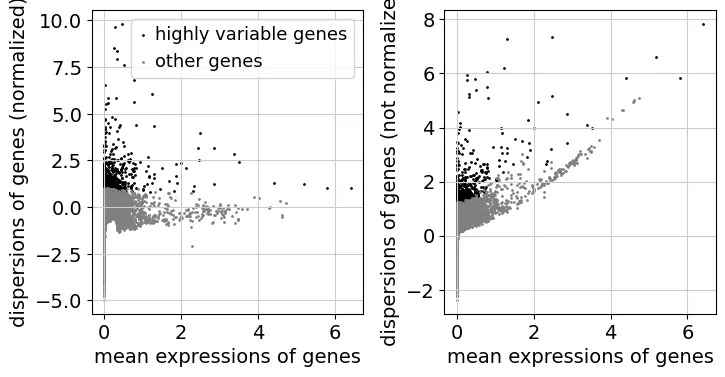 | 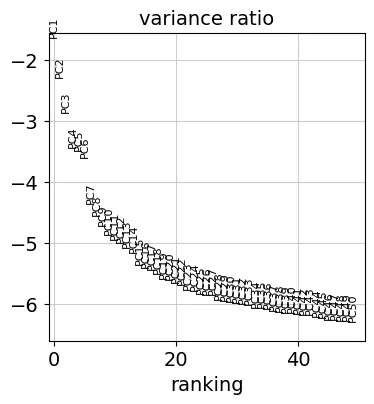 |

| PCA Plot |
|----------|
| 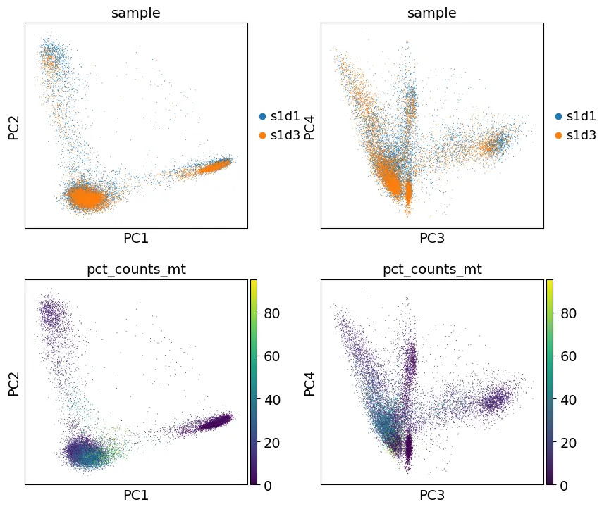 |

### UMAP

| UMAP by Sample | UMAP by Leiden |
|----------------|----------------|
|  |  |

| UMAP Doublets | UMAP QC Metrics |
|---------------|-----------------|
| 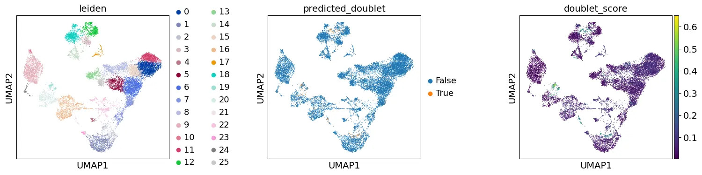 | 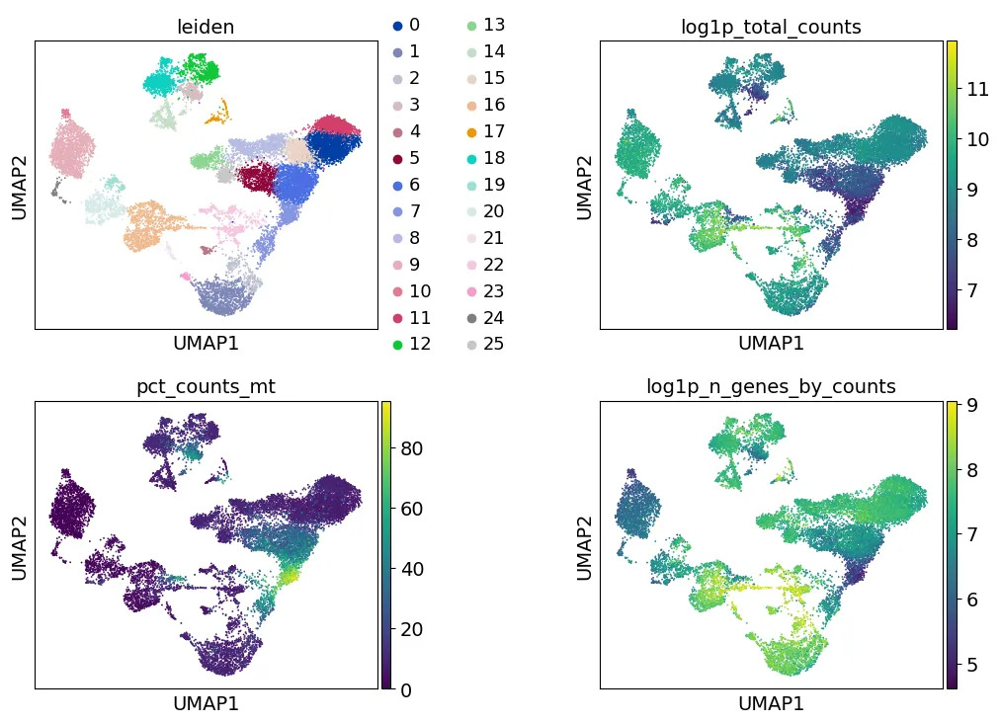 |

| UMAP Leiden Resolutions |
|------------------------|
| 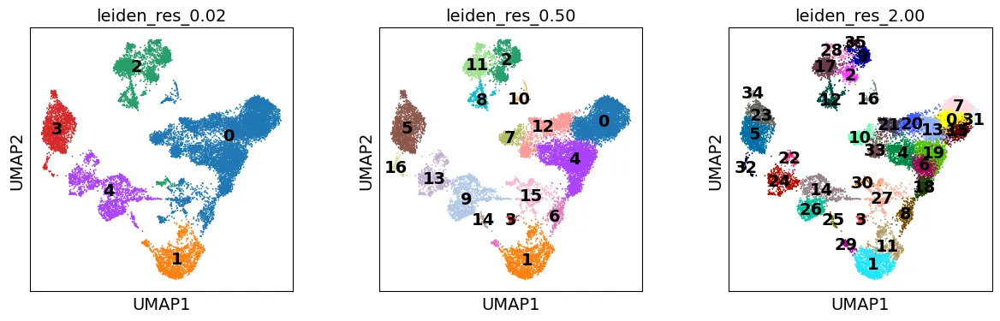 |

### Marker Genes

| Known Markers Dotplot | Ranked Genes Dotplot |
|----------------------|---------------------|
| 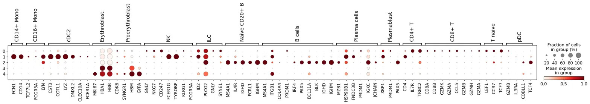 | 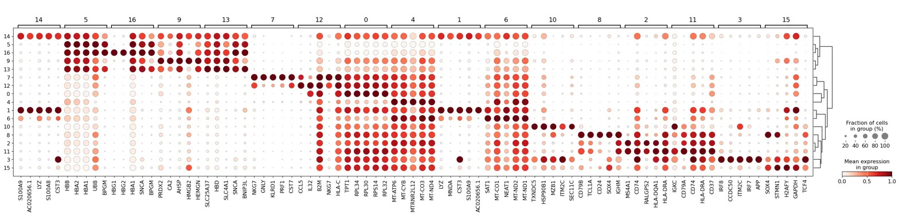 |

| Marker Gene UMAPs |
|------------------|
| 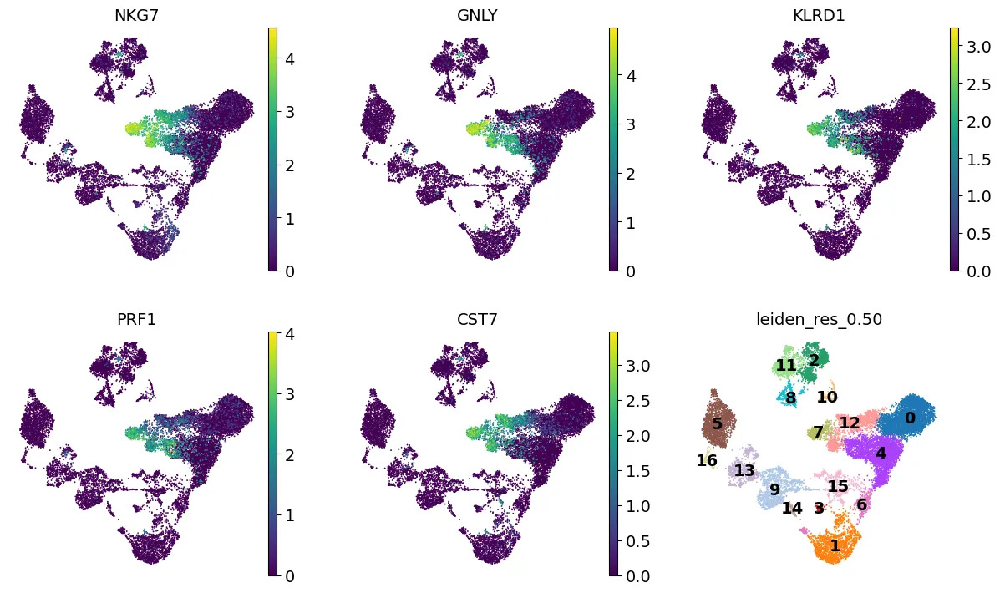 |

## Note on Output File

The final `pbmc_tutorial_output.h5ad` file (454 MB) exceeds GitHub's 100 MB file size limit and is therefore not tracked in this repository. The file was successfully generated locally by running the full Scanpy tutorial notebook on Google Colab.

## Platform

Run on Google Colab.

## Tutorial Reference

https://github.com/scverse/scanpy-tutorials/blob/main/basic-scrna-tutorial.ipynb
