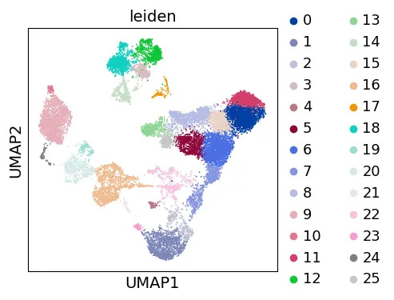
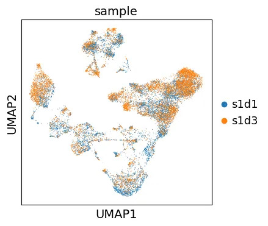
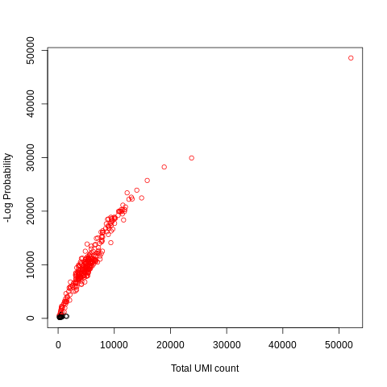
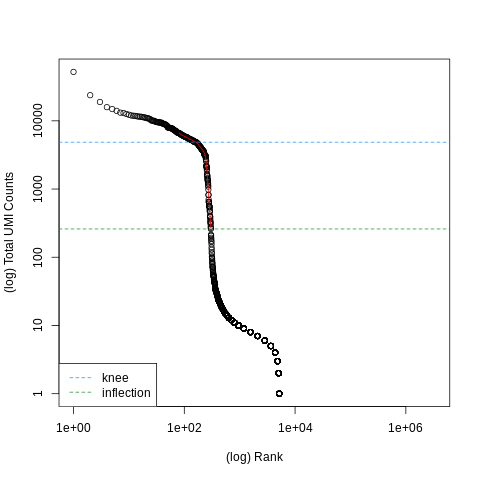

# scRNA-seq Galaxy Tutorials

Single-cell RNA-seq pipeline: 10X preprocessing on Galaxy, Scanpy clustering, and AnnData exploration.

## Overview

This repository documents a complete single-cell RNA-seq analysis pipeline carried out across three tutorials. Starting from raw 10X Chromium FASTQ reads, the pipeline covers alignment and UMI counting with STARsolo, cell barcode filtering with DropletUtils, quality control, normalization, dimensionality reduction, clustering with the Leiden algorithm, cell type annotation using marker genes, and a thorough exploration of the AnnData format that underpins all of these steps.

The dataset used in Tutorial 1 is a subset of the PBMC 1k v3 10X Chromium dataset, a standard benchmark in single-cell genomics. Tutorials 2 and 3 use bone marrow mononuclear cells from healthy human donors, originally part of the OpenProblems NeurIPS 2021 benchmarking dataset.

Galaxy steps were run on usegalaxy.eu. Scanpy and AnnData notebooks were run on Google Colab.

## Repository Structure
```
.
├── 01_tenx_preprocessing/       # Tutorial 1: STARsolo + DropletUtils on Galaxy
│   ├── outputs/                 # Filtered count matrix (barcodes, features, matrix) + plots
│   └── README.md
├── 02_basic_scrna_scanpy/       # Tutorial 2: Scanpy preprocessing & clustering
│   ├── outputs/                 # QC, PCA, UMAP, clustering plots
│   ├── basic-scrna-tutorial.ipynb
│   └── README.md
├── 03_anndata_tutorial/         # Tutorial 3: AnnData format exploration
│   ├── outputs/
│   ├── getting-started.ipynb
│   └── README.md
└── README.md
```

## Sections

### 1. Pre-processing of 10X Single-Cell RNA Datasets
Raw PBMC FASTQ reads from two sequencing lanes aligned to hg19 using RNA STARsolo with 10X Chromium v3 chemistry. Cell barcodes were filtered using DropletUtils with both DefaultDrops and EmptyDrops methods. MultiQC confirmed ~87.5% uniquely mapped reads. The output is a filtered count matrix in MTX format ready for downstream analysis.
 [Tutorial](https://training.galaxyproject.org/training-material/topics/single-cell/tutorials/scrna-preprocessing-tenx/tutorial.html)

### 2. Basic scRNA-seq Tutorial (Scanpy)
Filtered count matrix taken through a full Scanpy pipeline. Mitochondrial, ribosomal, and hemoglobin gene fractions were computed as QC metrics. Doublets were detected using Scrublet. Cells were filtered, counts normalized to median depth with log1p transformation, and the top 2000 highly variable genes selected. PCA, nearest neighbor graph construction, UMAP embedding, and Leiden clustering at multiple resolutions were performed. Cell types were annotated manually using curated marker genes and differentially expressed genes computed per cluster using the Wilcoxon test.
[Tutorial](https://github.com/scverse/scanpy-tutorials/blob/main/basic-scrna-tutorial.ipynb)

### 3. AnnData Tutorial
Hands-on introduction to the AnnData object: construction from sparse count matrices, indexing obs and var axes, adding observation and variable level metadata, storing multi-dimensional embeddings in obsm and varm, unstructured metadata in uns, multiple data representations in layers, conversion to Pandas DataFrames, writing to h5ad format with gzip compression, and views vs copies.
[Tutorial](https://anndata.readthedocs.io/en/latest/tutorials/notebooks/getting-started.html)

## Results

<table>
  <tr>
    <td align="center"><br/>UMAP Leiden Clusters</td>
    <td align="center"><br/>UMAP by Sample</td>
  </tr>
  <tr>
    <td align="center"><br/>Barcode Rank Plot</td>
    <td align="center"><br/>EmptyDrops Cell Detection</td>
  </tr>
</table>

## Platform

| Step | Platform |
|------|----------|
| Tutorial 1 | usegalaxy.eu |
| Tutorial 2 | Google Colab |
| Tutorial 3 | Google Colab |

## Tools

| Tool | Version | Purpose |
|------|---------|---------|
| RNA STARsolo | 2.7.11a+galaxy0 | Alignment + UMI counting |
| DropletUtils | 1.22.0+galaxy0 | Cell barcode filtering |
| MultiQC | 1.25.1+galaxy3 | QC report aggregation |
| Scanpy | 1.10.x | scRNA-seq analysis |
| AnnData | 0.11.x | Annotated data format |

## Data Sources

| Tutorial | Dataset | Source |
|----------|---------|--------|
| Tutorial 1 | PBMC 1k v3 subset | https://zenodo.org/record/3457880 |
| Tutorial 2 | Bone marrow MNCs (NeurIPS 2021) | doi:10.6084/m9.figshare.22716739.v1 |
| Tutorial 3 | Synthetic count data | Generated in notebook |


## Notes
- For detailed information, see the readme in separate directories.

## Citations

Luecken et al. (2021) Benchmarking atlas-level data integration in single-cell genomics. *Nature Methods*. https://doi.org/10.1038/s41592-021-01336-8

McCarthy et al. (2017) Scater: pre-processing, quality control, normalization and visualization of single-cell RNA-seq data in R. *Bioinformatics*. https://doi.org/10.1093/bioinformatics/btw777

Satija et al. (2015) Spatial reconstruction of single-cell gene expression data. *Nature Biotechnology*. https://doi.org/10.1038/nbt.3192

Stuart et al. (2019) Comprehensive Integration of Single-Cell Data. *Cell*. https://doi.org/10.1016/j.cell.2019.05.031

Traag et al. (2019) From Louvain to Leiden: guaranteeing well-connected communities. *Scientific Reports*. https://doi.org/10.1038/s41598-019-41695-z

Wolock et al. (2019) Scrublet: Computational Identification of Cell Doublets in Single-Cell Transcriptomic Data. *Cell Systems*. https://doi.org/10.1016/j.cels.2018.11.005

Zheng et al. (2017) Massively parallel digital transcriptional profiling of single cells. *Nature Communications*. https://doi.org/10.1038/ncomms14049
